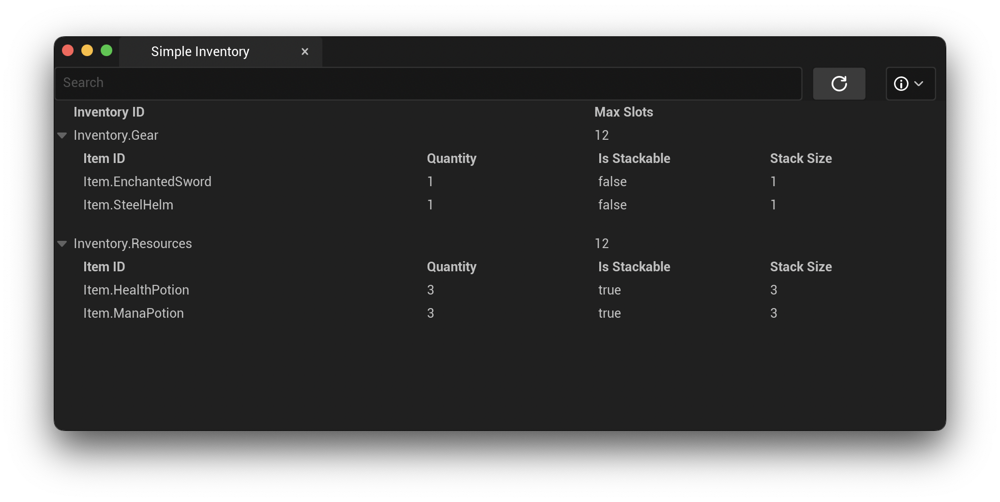
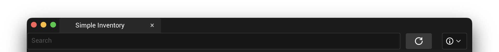

# Debugging Your Game

**SimpleInventory** comes packaged with an Editor Utility to allow you to view your game's inventories and items while running your game in PIE.



Once inventories are registered via the `SimpleInventorySubsystem`, all inventories defined in the Data Asset will be present within the Editor UI.

To open the editor, navigate to `Window -> Simple Inventory`.

## Editor Features

By default, the editor will display a Search Field, a Refresh Button, and a dropdown menu with a few options.



* **Search:** Search by inventory name.
* **Refresh Button:** Attempts to find inventories and display them in the editor. Inventories are only available while your game is running in PIE. Otherwise the inventory list will be blank.
* **Automatic Refresh:** Enabling **Automatic Refresh** in the editor will set a 1 second timer that automatically calls *Refresh*. While this should present no performance issues, be sure to disable this when you are not running your game in PIE. You may enable this to check in real time if your game is working as expected.
* **Verbose Logging:** When enabled, the `SimpleInventoryEditorLog` will send logs to the Output Log. Use this to debug the editor if inventories are not displaying correctly.

## Debugging SimpleInventory

### Logs

If **SimpleInventory** is not tracking inventories or items, the first step is to enable the logs in your project. To do this, you will need to open your project's `DefaultEngine.ini` file. At the end of the file, add the following lines:

```ini
[Core.Log]
SimpleInventoryLog=Verbose
SimpleInventoryEditorLog=Verbose
```

Enabling these will display the internal logs for **SimpleInventory**. These can be used to trace the execution path to see where the problem is occurring.

### Issues & Support

If you diagnose a problem with **SimpleInventory**, are unable to get it working properly, or have a new feature request, please add an issue to the [Github Issue Tracker](https://github.com/Ericdowney/SimpleInventoryExample/issues).