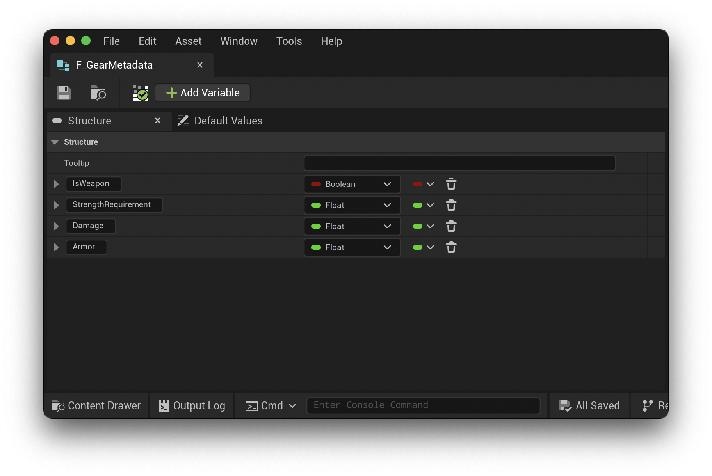
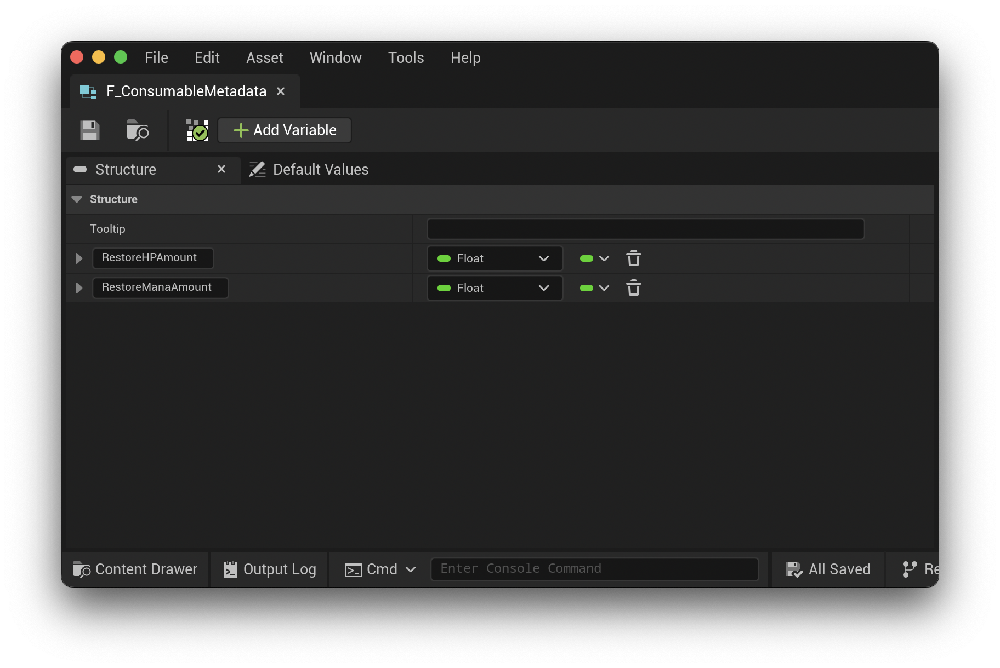
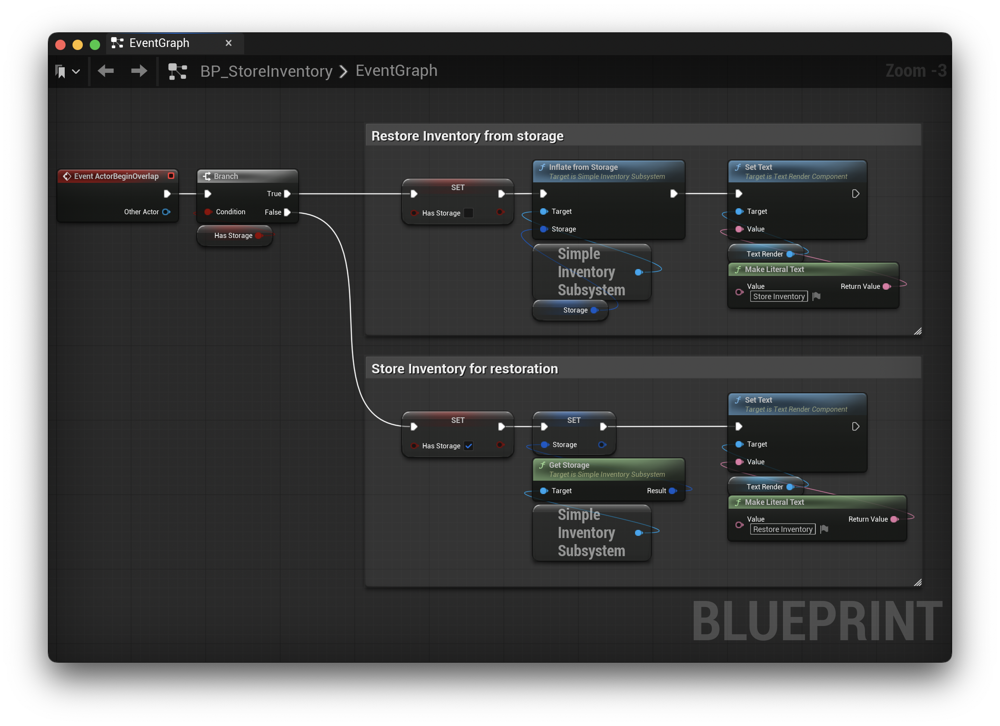
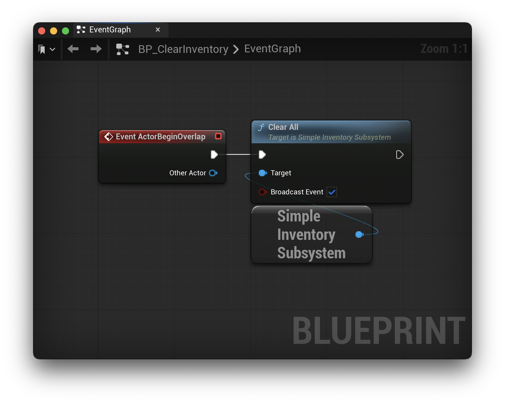
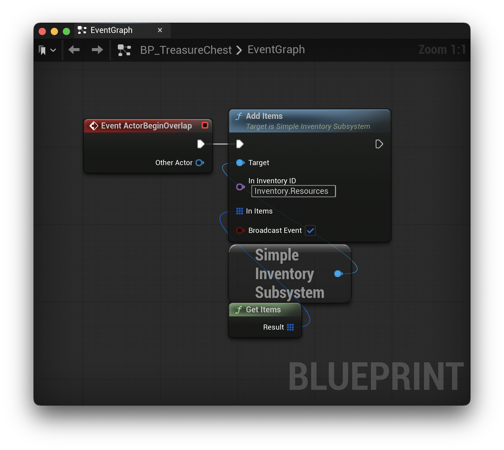

# Example Project

The provided example project uses the Unreal Engine 5.6 First Person template provided by Epic Games. I've added `SimpleInventory` to Lvl_FirstPerson.

In the example, I've registered two inventories:

* `Inventory.Gear`
* `Inventory.Resources`

## Subsystem Definition Asset

## Inventory Item Data Table

And I've created two categories of inventory items, *Gear* and *Resource*. The following structs are used in the `ItemMetadata` field.

**`F_GearMetadata`**

**`F_ConsumableMetadata`**

## `BP_CollectableItem`

The `BP_CollectableItem` blueprint is primary item actor in the example. It's responsible for adding the item to the player's inventory when they overlap the item in the game world.

On `BeginPlay`, it reads the item's `ItemName` field to display in the TextRender component. This is for debug purposes only as the example project items are all orange cubes.

On `ActorBeginOverlap`, it checks if the items can be added and, if true, adds the item to the correct inventory and destroys the actor.

## `BP_StoreInventory`

The `BP_StoreInventory` blueprint actor shows an example of converting the SimpleInventorySubsystem runtime data into storage data. It does this by calling `GetStorage` on the subsystem and holding a `FSimpleInventorySubsystemStorage` property.

In addition, it will restore the player's inventory with the `Storage` property using the `InflateFromStorage` function. *These are the same functions to use when saving data to and from disk.*

## `BP_ClearInventory`

The `BP_ClearInventory` blueprint actor shows can example of clearing all of the player's inventory data. In the example, if you walk across the `BP_StoreInventory` actor, then the `BP_ClearInventory` actor, and finally across the `BP_StoreInventory` actor one last time; You can observe in the editor the inventories being cleared and then restored to their state when saved.

## `BP_TreasureChest`

The `BP_TreasureChest` is a simplified example of an in-game reward system. It holds an array of Data Table Row Handles. Once the player actor overlaps with the `BP_TreasureChest` actor, the items are added to the correct inventory.

For more information on the specifics of how all of this is setup and works together, please see the [Setup Documentation](./Setup.md)