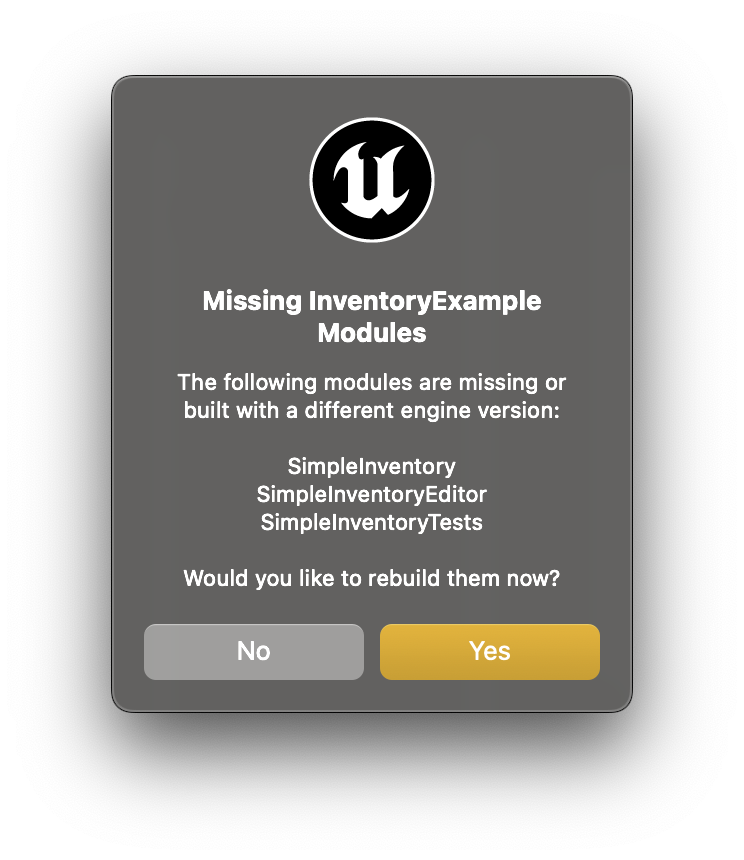
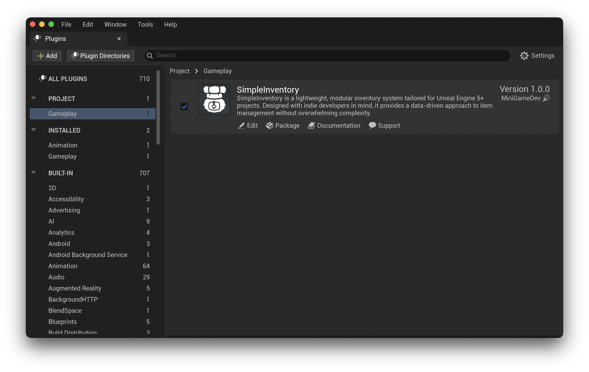

# Installation Guide

Installation will be handled through Fab and Unreal Engine, however, if you are manually installing the plugin from source, you can follow these steps:

* Copy `SimpleInventory/` into `Plugins/`.
* Open your project in Unreal Engine (You may be prompted to rebuild the project modules).

* Open `Edit -> Plugins` and enable **SimpleInventory**, if not already enabled.

