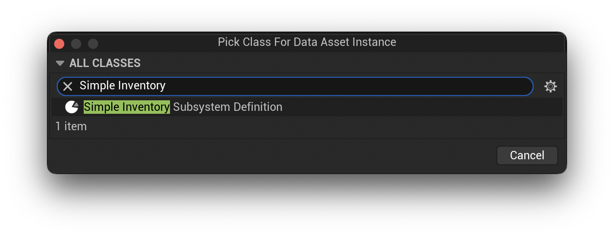
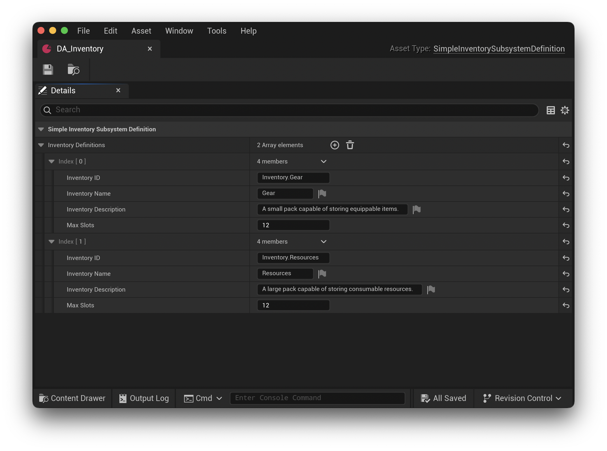
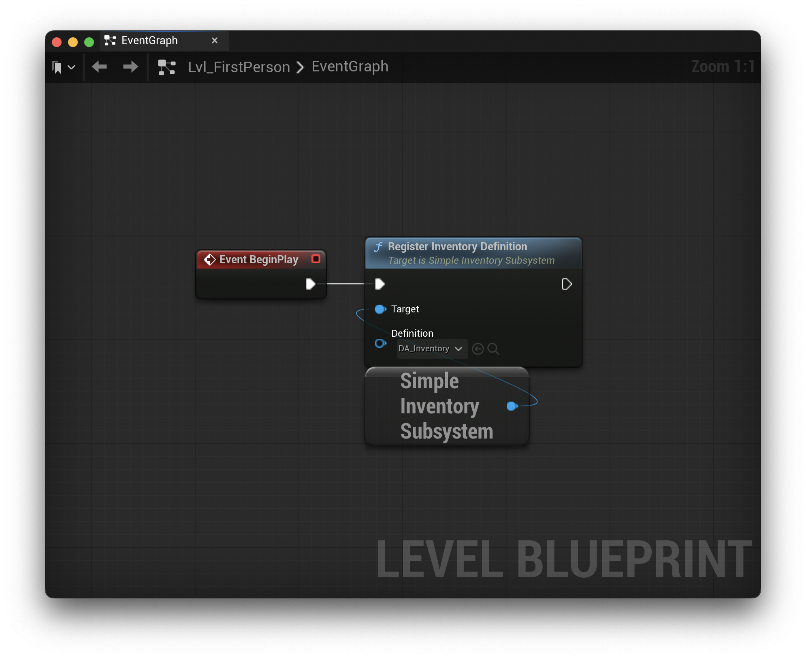
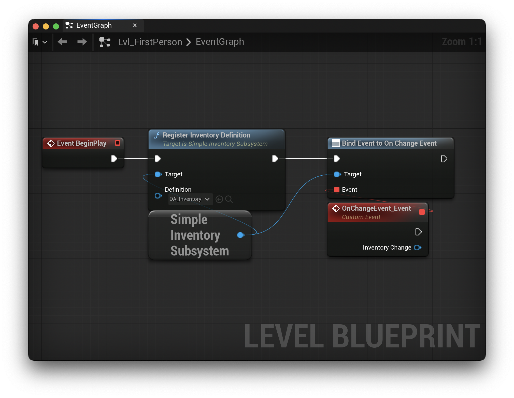
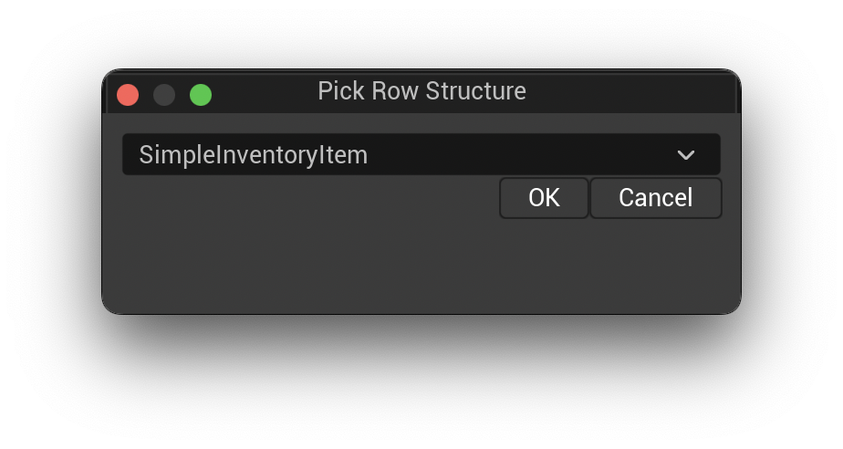
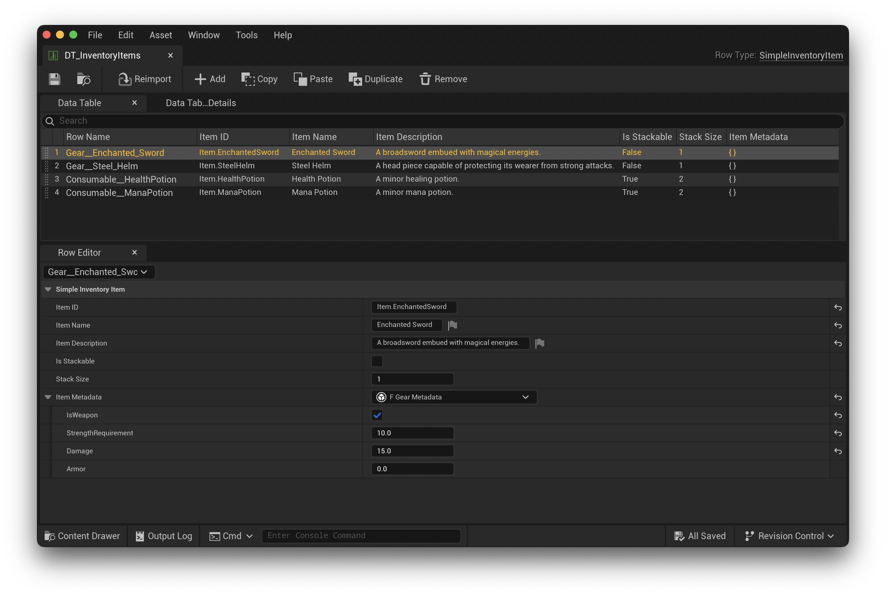
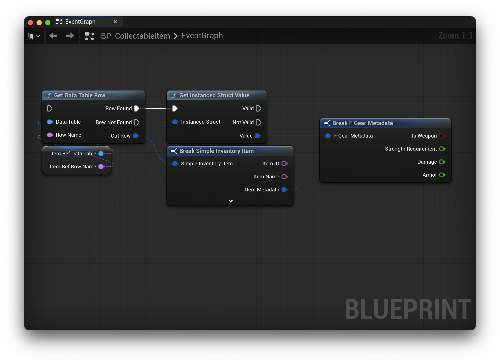
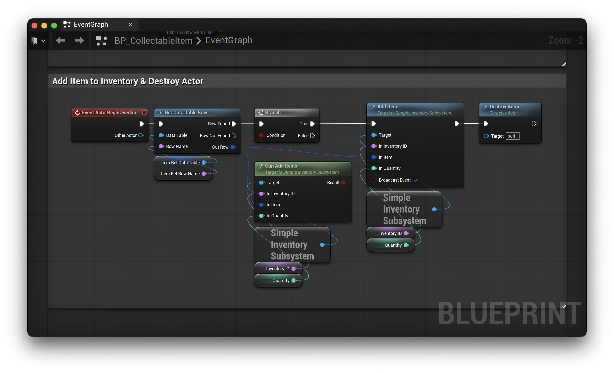

# Setup

Once the plugin is installed and enabled in Unreal Engine, if you want to use the plugin with C++, you will need to add `SimpleInventory` to your project file, `<YourGame>.uproject`, under `Modules -> AdditionalDepenedencies` and the `Plugins` array. Here's the example's project file for reference:

```
{
    "FileVersion": 3,
    "EngineAssociation": "5.6",
    "Category": "",
    "Description": "",
    "Modules": [
        {
            "Name": "AttributesPluginExample",
            "Type": "Runtime",
            "LoadingPhase": "Default",
            "AdditionalDependencies": [
                "Engine",
                "AIModule",
                "UMG",
                "CoreUObject",
                "SimpleInventory"
            ]
        }
    ],
    "Plugins": [
        {
            "Name": "ModelingToolsEditorMode",
            "Enabled": true,
            "TargetAllowList": [
                "Editor"
            ]
        },
        {
            "Name": "StateTree",
            "Enabled": true
        },
        {
            "Name": "GameplayStateTree",
            "Enabled": true
        },
		{
			"Name": "SimpleInventory",
			"Enabled": true
		}
    ]
}
```

## Create Data Asset

The plugin provides a `USimpleInventorySubsystemDefinition` class to create all of your inventories. In Unreal Engine, right click in the Content Browser and navigate to `Miscellaneous -> Data Asset`. Select `"Simple Inventory Subsystem Definition"` in the dialog.



With the Data Asset created, open it, and define your game's global inventories. The following is the data asset from the example project. It defines two inventories, `Inventory.Gear` and `Inventory.Resources`.



The `USimpleInventorySubsystemDefinition` can accept as many inventories as your game requires. Each inventory definition takes the following parameters:

* **Inventory ID** *(Required)* - The unique ID for the inventory. Used to query the subsystem.
* **Inventory Name** *(Optional)* - The displayable name for the inventory. Supports localization via Unreal Engine String Tables.
* **Inventory Description** *(Optional)* - The displayable description for the inventory. Supports localization via Unreal Engine String Tables.
* **Max Slots** *(Required)* - The maximum number of slots the inventory can hold. Each slot is capable of storing a single item with a quantity field. The quantity a slot can hold is determined by the inventory item.

## Register Inventory Subsystem Definition

To register the `USimpleInventorySubsystemDefinition`, the `USimpleInventorySubsystem` provides the following function:

**C++**

```c++
void RegisterInventoryDefinition(USimpleInventorySubsystemDefinition* Definition)
```

**Blueprint**



Please note that all inventories are identified by `InventoryID`. IDs must be unique. In the event you attempt to register an inventory with an existing ID, the subsystem will ignore the new inventory.

In addition, you may register as many inventory subsystem definition assets as you like provided the `InventoryID` properties are unique across all assets.

## Bind Events

There is a single event delegate that is published by the `SimpleInventorySubsystem`.

* `OnChangeEvent`

**Blueprint**



**C++**

```c++
SimpleInventorySubsystem->OnChangeEvent.AddDynamic(this, &<Class Name>::HandleInventoryChange);
```

The event, `OnChangeEvent`, is published when any registered inventory is modified. This can be used to update UI elements tied to inventories or inform different systems of the update.

### Inventory Change & Change Type

A `USimpleInventoryChange` object is passed back whenever an inventory is updated and the event is broadcast. This object contains the information about what changed and how much.

```c++
// Affected Inventory Identifier
UPROPERTY(BlueprintReadOnly, VisibleAnywhere, Category="Simple Inventory Change")
FName InventoryID;

// Change Type
UPROPERTY(BlueprintReadOnly, VisibleAnywhere, Category="Simple Inventory Change")
ESimpleInventoryChangeType Type = ESimpleInventoryChangeType::Addition;

// Item involved in the change.
UPROPERTY(BlueprintReadOnly, VisibleAnywhere, Category="Simple Inventory Change")
FSimpleInventoryItem Item;

// Amount added/removed in this change, -1 if not applicable.
UPROPERTY(BlueprintReadOnly, VisibleAnywhere, Category="Simple Inventory Change")
int32 QuantityChanged = -1;

// Slot index affected by the change, -1 if not applicable.
UPROPERTY(BlueprintReadOnly, VisibleAnywhere, Category="Simple Inventory Change")
int32 SlotIndex = -1;
```

Part of the above object is the enum, `ESimpleInventoryChangeType`. The enum represents the type of change that occurred. Here is a list of all possible change types:

* `Addition` – Items were added to the inventory.
* `Removal` – Items were removed from the inventory.
* `MultiRemoval` – Multiple items were removed at once.
* `Split` – A slot was split.
* `Merge` – Two slots were merged.
* `Full` – Inventory was full when trying to add items.
* `Clear` – Inventory was cleared.
* `Force` – Force broadcast of a change event. Useful for synchronizing UI even if a change has not occurred.

## Create Item Data Table

With your inventories defined, the next step is to define your inventory items. **SimpleInventory** provides the `FSimpleInventoryItem` struct for this purpose. It inherits from Unreal's `FTableRowBase` struct. This allows it to be used with Data Tables and this will be how you define your entire game's items.

To create a Data Table, navigate to your Content Browser, right click and navigate to `Miscellaneous -> Data Table`. Select `"Simple Inventory Item"` in the dialog.



The following screenshot shows the example project's item data table:



With the following 4 items defined:

* `Item.EnchantedSword`
* `Item.SteelHelm`
* `Item.HealthPotion`
* `Item.ManaPotion`

The `FSimpleInventoryItem` struct provides the base properties needed to manage inventory items:

* `FName ItemID` *(Required)* - The unique ID for the item. Used to manage the item.
* `FText ItemName` *(Optional)* - The displayable name for the item. Supports localization via Unreal Engine String Tables.
* `FText ItemDescription` *(Optional)* - The displayable description for the item. Supports localization via Unreal Engine String Tables.
* `bool bIsStackable` - Determines whether the item can be stacked in a single slot. When false, if more than one item of this type is held, multiple slots will be used.
* `int32 StackSize` - The quantity of items that can be stacked in a single slot until a new slot will be allocated.
* `FInstancedStruct ItemMetadata` - Custom project level metadata. Can accept any custom struct.

Once configured, items can managed by your configured inventories. Please note, no configuration or data directly ties a specific item to a specific inventory. Any `FSimpleInventoryItem` can be managed by any `USimpleInventory`. Based on the complexity of your game, you may need a single inventory or many inventories.

It is good practice to define your items (based on your game's concept of item category) in separate Data Tables. This way, there's no confusion about what type of item you're editing when working in your Data Tables. I would also recommend creating separate inventories based on that same category.

### `ItemMetadata`

On the `FSimpleInventoryItem` struct, the property `ItemMetadata` exists to hold the custom data structure for your game. As long as you define a struct type, it will be available to use in the `ItemMetadata` field.

In the example project, I defined `F_GearMetadata` and `F_ResourceMetadata` structs to hold specific data for my gear and resource item types.

In the `FSimpleInventoryItem` implementation, this property is using an `FInstancedStruct` type. This is a type erased struct value and can hold any type of struct. However, if you define your custom item metadata structs in C++, you will need to ensure your struct inherits from `FTableRowBase` so fields are editable in the data table. If you create your metadata structs in Blueprints, this is already handled for you.

To access your item's metadata, you will need to unwrap the `ItemMetadata` field.

**C++**

```c++
FSimpleInventoryItem Item;
// ...
if (Item.ItemMetadata.IsValid()) {
    MyGameItemMetadata& GameItemMetadata = Item.ItemMetadata.Get<MyGameItemMetadata>();

    // Now you can access members of your specific Metadata struct
}
```

**Blueprints**



## Accessing & Adding Items

Whether you are using C++ or Blueprints, to access items in your game, you will need to use a `Data Table Row Handle`. This provides a Data Table reference and a Row Name. In the example project, I've created `BP_CollectableItem` to hold the logic of accessing the specific item row and adding it to the correct inventory.

It holds the following variables:

* `InventoryID` - The InventoryID to pass to the subsystem so gear and resources are placed in the correct inventory.
* `ItemRef` - The Data Table Row Handle used to get the specific item for this instance.
* `Quantity` - Defaults to 1. The amount of this item to add to the inventory.

In the example, I add the item to the player's inventory when the two actors overlap. In your game, this can be tied to any action like interacting, quest rewards, etc.

The below screenshot shows how I add the item to the inventory. It first gets access to the specific item via the `ItemRef`, then it uses the `CanAddItems` function to check if the item can be added to the inventory.

The `CanAddItems` function checks to ensure the item and the specific quantity can be added to the inventory. Please note, the `AddItem` function will add as many items to the inventory as possible. Due to this behavior it is possible for the inventory to fill up before adding all of the requested item quantity.

And once the items are added, the collectable item is destroyed.



For more information on all the available functions, please see the [API Reference](./APIReference.md) documentation.