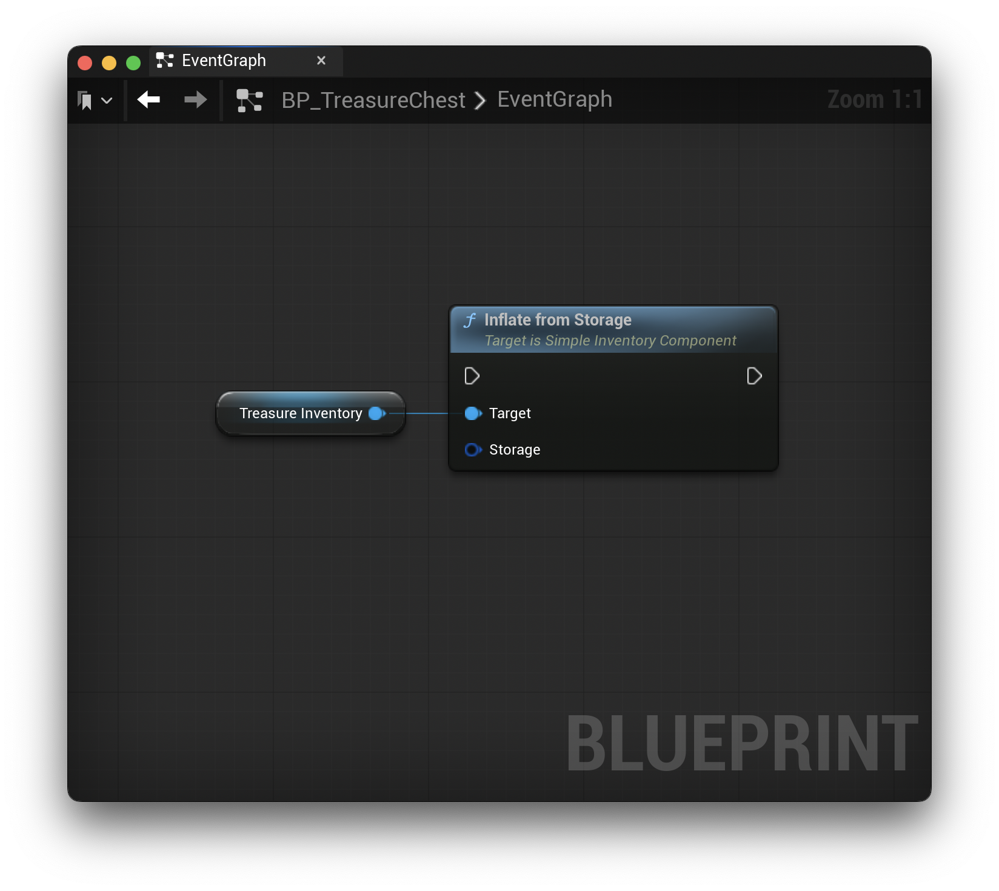

# Storage

**SimpleInventory** provides a structure meant to be used in conjunction with Unreal's `USaveGame` class, as well as a simple API to save and load attribute data in the subsystem. This allows you to save attribute data however you like.

*All functionality is supported by both Blueprints and C++.*

## FSimpleInventorySubsystemStorage

The `FSimpleInventorySubsystemStorage` struct stores the list of registered inventories with their values.

To use this in your project, simply add this to your `USaveGame` subclass:

```c++
UPROPERTY(/* Property Config */)
FSimpleInventorySubsystemStorage Inventory;
```

### Saving Subsystem Data

The `USimpleInventorySubsystem` provide two APIs for storage. The first is to retrieve the current state as storage:

**C++**

```c++
FSimpleInventorySubsystemStorage GetStorage()
```

**Blueprints**


This function collects all registered inventories, converts them to storage, and returns the result.

The second API is used to restore inventory data to the subsystem.

**C++**

```c++
void InflateFromStorage(const FSimpleInventorySubsystemStorage Storage)
```

**Blueprints**


You can pass the same data structure back to the `InflateFromStorage` function to restore all previously saved inventories.

### Saving Component Data

The `USimpleInventoryComponent` provides two APIs, similar to the subsystem, for storage. The first API retrives the current component state as storage:

**C++**

```c++
FSimpleInventoryStorage GetStorage() const
```

**Blueprints**


Since the `USimpleInventoryComponent` is only responsible for a single inventory, the storage data is for a single inventory. Depending on your game's needs, you can create your own data structure to store these single inventory data structures.

The second API is to restore the inventory data to the component.

**C++**

```c++
void InflateFromStorage(FSimpleInventoryStorage Storage)
```

**Blueprints**



**Please note:**, the `InflateFromStorage` functions overwrite any existing data. If you already have inventories registered, they will be removed.